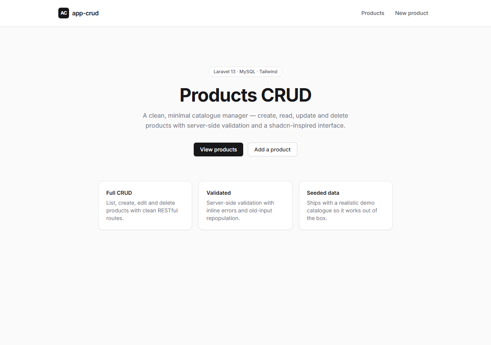
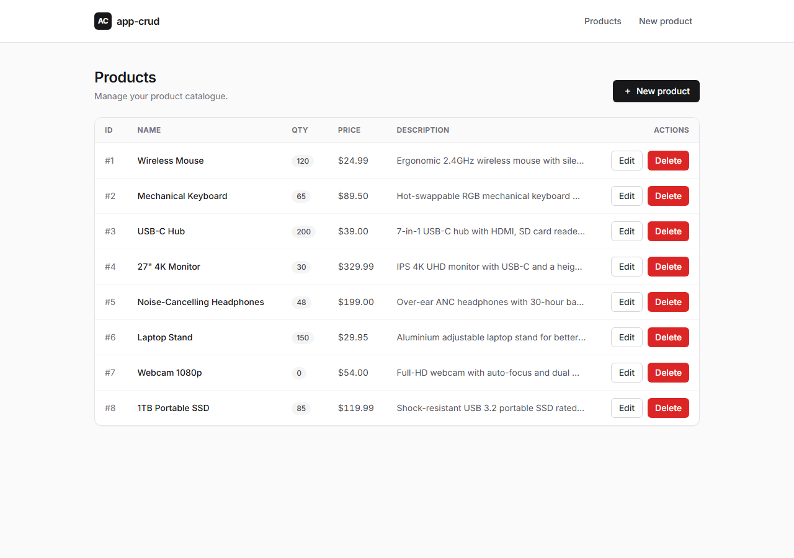
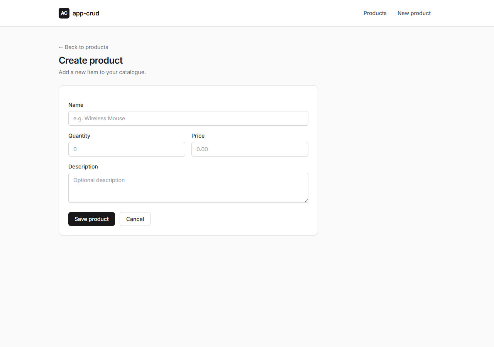
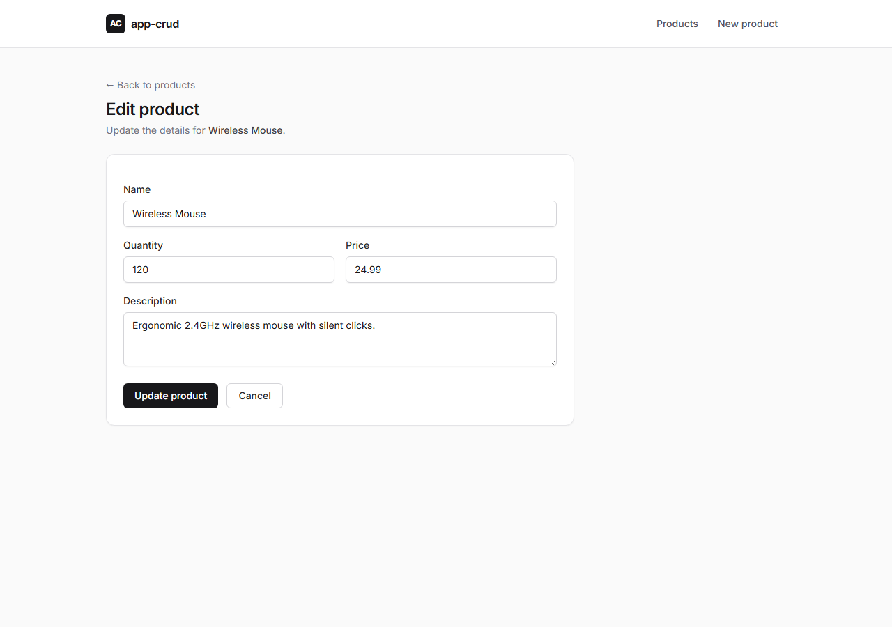

# app-crud

A clean, minimal **Products CRUD** application built with **Laravel 13**. It demonstrates the full create / read / update / delete cycle with server-side validation, flash messaging, seeded demo data, and a tidy, shadcn-inspired UI rendered with Blade and Tailwind CSS.

---

## Features

- **Full CRUD** for products (name, quantity, price, description)
- **Server-side validation** with inline error display and old-input repopulation
- **Flash messages** on successful update/delete
- **Seeded demo catalogue** (8 realistic products) for instant preview
- **shadcn-style UI** — neutral palette, cards, styled buttons/inputs/tables — via Tailwind (CDN, no build step)
- **Shared Blade layout** so views stay DRY

---

## Tech stack

| Layer       | Choice                                            |
| ----------- | ------------------------------------------------- |
| Framework   | Laravel 13 (PHP 8.3)                               |
| Database    | MySQL / MariaDB (XAMPP)                            |
| Views       | Blade templates                                    |
| Styling     | Tailwind CSS via CDN, shadcn-inspired components   |
| Testing     | PHPUnit                                            |

> **Note on shadcn:** the official [shadcn/ui](https://ui.shadcn.com) is a React component library that requires a build step, so it can't be dropped into a Blade app directly. This project recreates the shadcn **design language** (zinc palette, rounded cards, subtle borders, Inter font, signature button/input styles) using Tailwind utility classes — the same look with zero front-end build.

---

## Screenshots

### Home


### Product list


### Create product


### Edit product


---

## Getting started

### Prerequisites
- PHP 8.3+
- Composer
- MySQL / MariaDB (e.g. via [XAMPP](https://www.apachefriends.org/))

### Installation

```bash
# 1. Install PHP dependencies
composer install

# 2. Create your environment file
cp .env.example .env

# 3. Generate the application key
php artisan key:generate
```

### Configure the database

Create a database named `app-crud` in MySQL, then set these values in `.env`:

```env
DB_CONNECTION=mysql
DB_HOST=127.0.0.1
DB_PORT=3306
DB_DATABASE=app-crud
DB_USERNAME=root
DB_PASSWORD=
```

> If you change `.env` while the app is running, clear the cached config: `php artisan config:clear`.

### Migrate & seed

```bash
php artisan migrate --seed
```

This creates the tables and loads the 8 demo products. (Use `php artisan migrate:fresh --seed` to rebuild from scratch.)

### Run

```bash
php artisan serve
```

Then open **http://127.0.0.1:8000/product**.

---

## Routes

| Method   | URI                         | Name             | Action                |
| -------- | --------------------------- | ---------------- | --------------------- |
| `GET`    | `/product`                  | `product.index`  | List all products     |
| `GET`    | `/product/create`           | `product.create` | Show create form      |
| `POST`   | `/product`                  | `product.store`  | Persist a new product |
| `GET`    | `/product/{product}/edit`   | `product.edit`   | Show edit form        |
| `PUT`    | `/product/{product}/update` | `product.update` | Persist changes       |
| `DELETE` | `/product/{product}/delete` | `product.delete` | Delete a product      |

---

## Project structure

```
app/
  Http/Controllers/ProductController.php   # CRUD actions
  Models/Product.php                       # Eloquent model (mass-assignable fields)
database/
  factories/ProductFactory.php             # Fake product generator
  migrations/..._create_products_table.php # products schema
  seeders/ProductSeeder.php                # demo catalogue
resources/
  views/layouts/app.blade.php              # shared shell + Tailwind + UI styles
  views/products/{index,create,edit}.blade.php
routes/
  web.php                                   # product routes
docs/
  screenshots/                             # README images
```

---

## Notes

- **XAMPP on Windows:** if MySQL won't start or Composer fails with "Permission denied", add an antivirus exclusion for `C:\xampp` (Windows Defender can lock files mid-write) and run the XAMPP Control Panel as Administrator.
